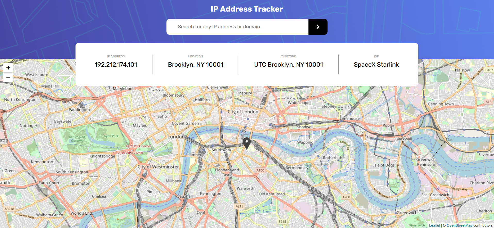
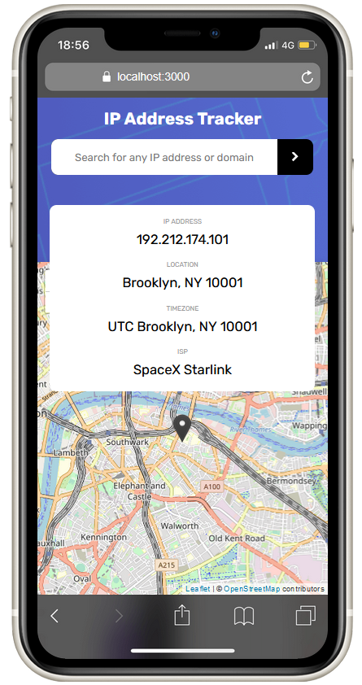

# Frontend Mentor - IP address tracker solution

This is a solution to the [IP address tracker challenge on Frontend Mentor](https://www.frontendmentor.io/challenges/ip-address-tracker-I8-0yYAH0). Frontend Mentor challenges help you improve your coding skills by building realistic projects.

## Table of contents

- [Frontend Mentor - IP address tracker solution](#frontend-mentor---ip-address-tracker-solution)
  - [Table of contents](#table-of-contents)
  - [Overview](#overview)
    - [The challenge](#the-challenge)
    - [Screenshots](#screenshots)
    - [Links](#links)
  - [My process](#my-process)
    - [Built with](#built-with)
    - [Useful resources](#useful-resources)
  - [Author](#author)
  - [Acknowledgments](#acknowledgments)

## Overview

### The challenge

Users should be able to:

- View the optimal layout for each page depending on their device's screen size
- See hover states for all interactive elements on the page
- See their own IP Address on the map on the initial page load
- Search for any IP addresses or domains and see the key information and location

### Screenshots

Desktop screenshot

Mobile screenshot

### Links

- Solution URL : [IP Address Tracker](https://github.com/Axurynn/ip-address-tracker)
- Live solution: [IP Address Tracker - Live](https://axurynn.github.io/ip-address-tracker/)

## My process

### Built with

- Semantic HTML5 markup
- SCSS custom properties
- Flexbox
- Mobile-first workflow
- [ReactJS](https://reactjs.org/) library
- [React Leaflet](https://react-leaflet.js.org/)
- [ViteJS](https://vitejs.dev/)

### Useful resources

- [React Leaflet](https://react-leaflet.js.org/)
- [Leaflet](https://leafletjs.com/)

## Author

- Website - [Axurynn](https://axurynn.fr)
- Frontend Mentor - [@axurynn](https://www.frontendmentor.io/profile/axurynn)
- Twitter - [@Drc_Axu](https://www.twitter.com/Drc_Axu)

## Acknowledgments

Special thanks to [Baptjack](https://baptjack.fr) who help me completed this challenge.
